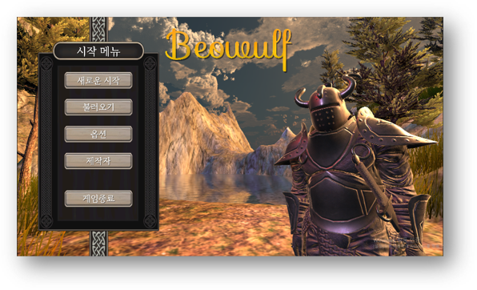
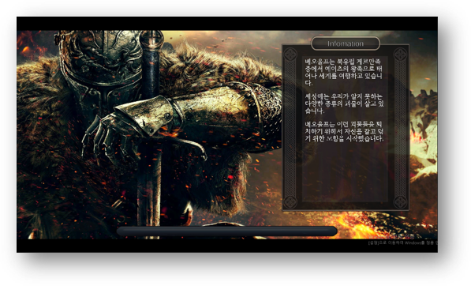
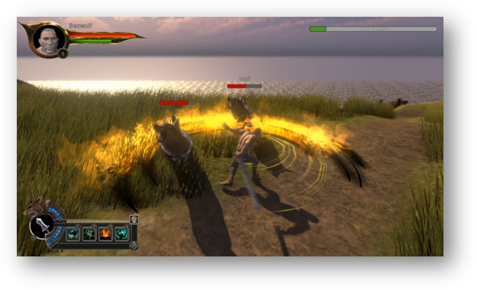
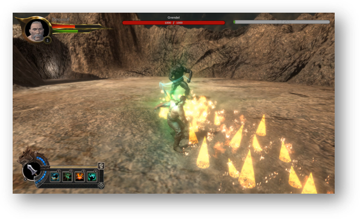

# 🛡️ Beowulf: Unity Action RPG Prototype

Beowulf는 중세 시대를 배경으로 한 Unity로 제작한 싱글 액션 RPG 게임 프로토타입입니다.  
1인 프로젝트로 RPG 게임을 밑바닥부터 개발해보는 경험이 되었습니다.

👉 [View English Version](./README_EN.md)

---

## 📂 프로젝트 구성 요약

- `Assets/01_Scenes`: 로딩, 메인 메뉴, 튜토리얼, 스테이지 등 게임 씬
- `Assets/02_Models`: 캐릭터, 무기 모델링
- `Assets/03_04_Animations`: 애니메이션 및 상태머신
- `Assets/05_Environment`: 지형, 배경, 스카이박스
- `Assets/06_Scripts`: **주요 게임 로직 구현부**
- `Assets/07_Prefabs`: 캐릭터, 무기, UI 프리팹
- `Assets/08_UI Resources`: UI 이미지 및 아이콘
- `Assets/09_Sounds`: 배경음악 및 효과음

---

## 📸 Screenshots

| Main Menu | Loading Scene |
|-----------|----------------|
|  |  |

| Gameplay 1 | Gameplay 2 |
|------------|-------------|
|  |  |

---

## 🧩 주요 시스템 구성

### 🎮 PlayerController.cs
- 입력 기반 캐릭터 조작 (이동, 회피, 공격)
- 무기 장착 기능과 연동 (`EquipManager.cs`)
- 플레이어 상태와 입력을 조합해 공격 애니메이션 트리거

### 🧠 AI 시스템 (Panda Behaviour 기반)
- `EnemyBase.cs`, `Sense.cs`, `Perspective.cs`, `Aspect.cs`, `Wander.cs` 등으로 구성
- 시야 기반 감지 → 상태 변경 → 공격 등의 행동 제어
- PandaBehaviour Tree를 사용한 시야 감지, 주변 탐색, 순찰, 공격 기능
- 스크립터블 노드 기반 AI 구성

### 🗡️ 무기 및 장비 시스템
- `EquipManager.cs`, `Weapon.cs`
- 무기 장착 및 공격 시 이펙트 표현
- 각 무기별 애니메이션 연동 및 특성 적용 가능

### 📜 퀘스트 시스템
- `Quest.cs`, `QuestGoal.cs`, `QuestManager.cs`, `QuestGiver.cs`, `QuestInfoSlot.cs`
- 퀘스트 수락, 목표 달성, 완료 처리 및 UI 연동
- 단계별 퀘스트 및 보상 구조 포함

### 🖼️ UI 시스템
- 인벤토리, NPC 대화, 퀘스트 창, 플레이어 정보
- 인벤토리: `Inventory.cs`, `DragSlot.cs`, `EquipSlot.cs`, `Item.cs`, `ItemDescription.cs`
- NPC 대화창: `DialogueManager.cs`, `DialogueTrigger.cs`, `Dialogue.cs`
- 퀘스트 UI: `QuestInfoSlot.cs`, `QuestWindow.prefab`, `NotificationMessage.cs`
- 플레이어 정보창: `PlayerInfo.cs`
- UI 전체 제어: `UIManager.cs`, `UIShower.cs`, `DragableUI.cs`

### 🎬 씬 & 연출
- `SceneCurtain.cs`를 통한 페이드 인/아웃 애니메이션
- `ActionCam.cs`로 시네마틱 카메라 연출
- `LoadingSceneManager.cs`로 비동기 씬 로딩 구현

### 🔈 사운드 & 이벤트
- 게임 내 효과음 재생, 싱글톤 이벤트 시스템
- `SoundManager.cs`: BGM 및 효과음 재생
- `EventManager.cs`: 게임 내 전역 이벤트 호출 및 리스너 관리

---

## 🛠 기술 스택

| 구성 요소            | 사용 기술 / 설명                             |
|---------------------|----------------------------------------------|
| 🎮 게임 엔진         | Unity 2022.3.62f1                            |
| 🎨 렌더링 파이프라인 | **Built-in Render Pipeline**                |
| 🧩 UI 시스템         | Unity UI, TextMesh Pro                       |
| 🧠 AI 시스템         | Panda Behaviour Tree (외부 플러그인)        |
| 🎞️ 애니메이션        | Animator Controller + FBX 애니메이션        |
| 💬 대화 시스템       | `DialogueManager.cs`, `DialogueTrigger.cs`  |
| 🧭 퀘스트 시스템      | ScriptableObject 및 `QuestManager.cs` 기반   |
| 🔊 사운드 시스템      | `SoundManager.cs` + AudioSource              |
| 📦 이벤트 처리       | 싱글톤 기반 `EventManager.cs`                |

각 모듈은 유지 보수성과 확장성을 높이기 위해 모듈화되고 분리된 구조로 설계되었습니다.

---

## 📄 License

This project is licensed under the [MIT License](https://opensource.org/licenses/MIT).

> ※ This project is intended for **portfolio and educational purposes** only.  
> ※ 일부 리소스는 외부 에셋을 포함하고 있으며, 각 에셋의 라이선스에 따릅니다.

---

## 🙋 Author

- **Name**: 김제혁
- **GitHub**: [https://github.com/alis7430](https://github.com/alis7430)  
- **Email**: os2dr@naver.com