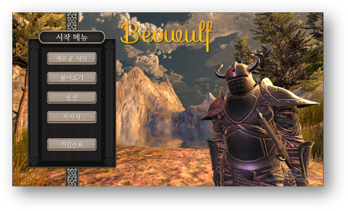
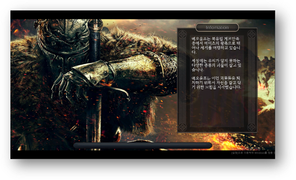
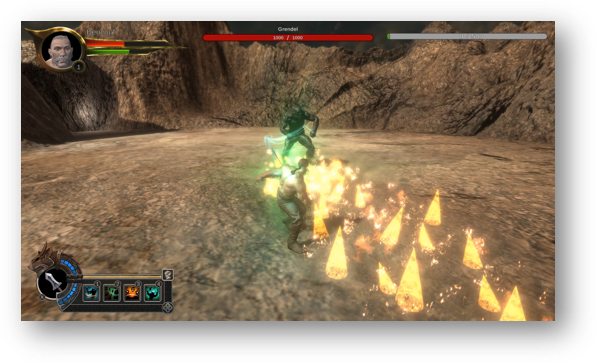

# 🛡️ Beowulf: Unity Action RPG Prototype

Beowulf is a single action RPG game prototype set in a medieval world, developed using Unity.  
This solo project was developed to gain hands-on experience in building an RPG system entirely from scratch.

👉 [README in Korean (README.md)](./README.md)

---

## 📂 Project Structure Overview

- `Assets/01_Scenes`: Game scenes including loading, main menu, tutorial, and stage levels
- `Assets/02_Models`: 3D models for characters and weapons
- `Assets/03_04_Animations`: Animations and animator controllers
- `Assets/05_Environment`: Terrain, environment assets, skybox, etc.
- `Assets/06_Scripts`: **Core gameplay logic scripts**
- `Assets/07_Prefabs`: Prefabs for characters, weapons, UI, etc.
- `Assets/08_UI Resources`: UI sprites, icons
- `Assets/09_Sounds`: Background music and sound effects

---

## 📸 Screenshots

| Main Menu | Loading Scene |
|-----------|----------------|
|  |  |

| Gameplay 1 | Gameplay 2 |
|------------|-------------|
|  |  |

---

## 🧩 Key Systems

### 🎮 PlayerController.cs
- Handles character input for movement, evasion, and attacking
- Interacts with `EquipManager.cs` for weapon control
- Triggers attack animations based on input and equipped state

### 🧠 AI System (Panda Behaviour Tree)
- Composed of `EnemyBase.cs`, `Sense.cs`, `Perspective.cs`, `Aspect.cs`, `Wander.cs`, etc.
- Vision-based detection → state transitions → attack logic
- Includes enemy detection, patrol, and combat decision logic.
- Modular, node-based architecture

### 🗡️ Equipment & Weapon System
- `EquipManager.cs`, `Weapon.cs`
- Manages weapon equips and combat logic including visual effects
- Each weapon has its own animation pattern and behavior

### 📜 Quest System
- Includes `Quest.cs`, `QuestGoal.cs`, `QuestManager.cs`, `QuestGiver.cs`, `QuestInfoSlot.cs`
- Accept → progress → complete quests with conditions and rewards
- Supports multi-step quest chains with UI integration

### 🖼️ UI System
- Includes inventory, NPC dialogues, quest UI, and player info
- Inventory: `Inventory.cs`, `DragSlot.cs`, `EquipSlot.cs`, `Item.cs`, `ItemDescription.cs`
- Dialogue: `DialogueManager.cs`, `DialogueTrigger.cs`, `Dialogue.cs`
- Quest UI: `QuestInfoSlot.cs`, `QuestWindow.prefab`, `NotificationMessage.cs`
- Other: `PlayerInfo.cs`, `UIManager.cs`, `UIShower.cs`, `DragableUI.cs`

### 🎬 Scene & Camera Transitions
- `SceneCurtain.cs`: fade in/out transition effect
- `ActionCam.cs`: cinematic camera movement
- `LoadingSceneManager.cs`: handles async scene loading

### 🔈 Sound & Events
- `SoundManager.cs`: background music and SFX control
- `EventManager.cs`: singleton-based global event dispatcher

---

## 🛠 Tech Stack

| Component            | Technology / Description                        |
|----------------------|-------------------------------------------------|
| 🎮 Game Engine        | Unity 2022.3.62f1                                |
| 🎨 Render Pipeline    | **Built-in Render Pipeline**                   |
| 🧩 UI System          | Unity UI, TextMesh Pro                          |
| 🧠 AI System          | Panda Behaviour Tree (external plugin)         |
| 🎞️ Animation         | Animator Controller with FBX-based clips       |
| 💬 Dialogue System    | `DialogueManager.cs`, `DialogueTrigger.cs`     |
| 🧭 Quest System       | ScriptableObject + `QuestManager.cs`           |
| 🔊 Audio System       | `SoundManager.cs` + AudioSource                 |
| 📦 Event Handling     | Singleton-based `EventManager.cs`              |

Each module is designed to be modular and decoupled for easier maintenance and scalability.

---

## 📄 License

This project is licensed under the [MIT License](https://opensource.org/licenses/MIT).

> ※ This project is intended for **portfolio and educational purposes** only.  
> ※ 일부 리소스는 외부 에셋을 포함하고 있으며, 각 에셋의 라이선스에 따릅니다.

---

## 🙋 Author

- **Name**: Je Hyeok Kim
- **GitHub**: [https://github.com/alis7430](https://github.com/alis7430)  
- **Email**: os2dr@naver.com